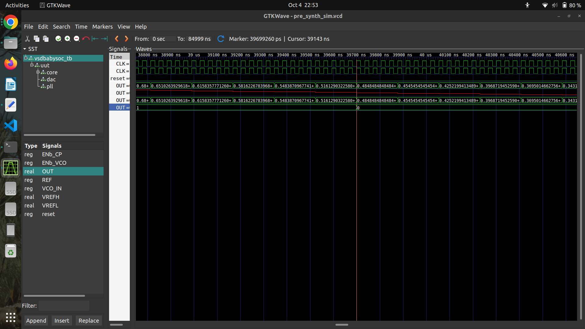
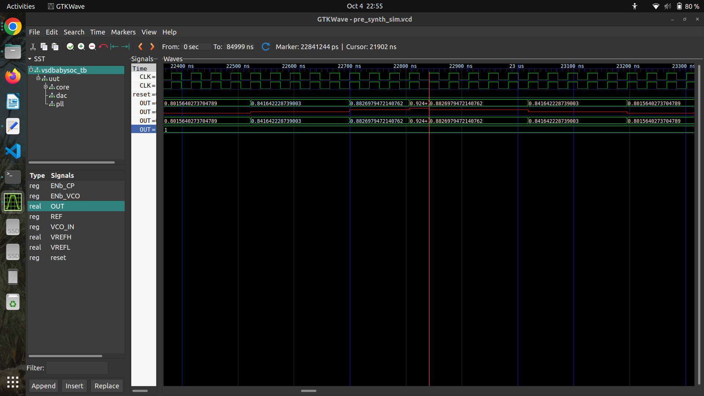

---

# 🧠 VSDBabySoC — System-on-Chip (SoC) Learning & Simulation

---

## Part 1 — Fundamentals of SoC and BabySoC

### 🔹 What is a System-on-Chip (SoC)?

A **System-on-Chip (SoC)** integrates all essential computing components onto a **single silicon chip**, including:

* **CPU / Processor** – Executes instructions and manages control flow
* **Memory** – Stores program instructions and data (SRAM, ROM, cache)
* **Peripherals / IP Blocks** – Handle I/O and system tasks (UART, SPI, GPIO, timers, DMA)
* **Interconnect / Bus / NoC** – Manages communication between modules
* **Clock, Reset, Power Management** – Synchronizes operations and power domains

**Benefits of SoC:**

* ⚡ Higher performance – faster on-chip data transfers
* 🔋 Lower power consumption – reduced off-chip communication
* 📏 Reduced size and cost – fewer chips/components
* 🧩 Improved reliability – fewer inter-chip interfaces

💡 *Examples:* Smartphones (Snapdragon), Automotive Controllers (NVIDIA DRIVE), IoT devices (ESP32), Edge AI processors (Google Coral TPU)

---

### 🔹 Why BabySoC?

**BabySoC** is a **simplified learning model** for SoC concepts:

* Demonstrates CPU ↔ Memory ↔ Peripheral data flow
* Teaches basic bus operations and interrupts
* Shows memory mapping and register interfacing

It is small enough for **learning core concepts** but still reflects real SoC design principles.


### 🔹 Role of Functional Modelling

Before RTL or physical design, SoC behavior is modeled at a higher abstraction (C/C++ or SystemC):

* ✅ Validate architecture early
* ⚖️ Explore design trade-offs
* 💻 Enable early software/firmware development
* 💰 Reduce verification cost/time

Functional models serve as **golden references** for RTL verification.

---

### 🔹 BabySoC Learning Journey

1. 🧩 **Functional Modelling** – Understand high-level behavior
2. 💻 **RTL Design** – Implement modules in Verilog/VHDL
3. 🧪 **Integration & Verification** – Combine modules and simulate
4. ⚙️ *(Optional)* **Physical Design** – Synthesize, place & route

---

## Part 2 — Simulation & Verification of VSDBabySoC

### 🔹 What is VSDBabySoC?

**VSDBabySoC** is a **compact SoC** designed to integrate digital and analog IPs:

* **RVMYTH** – Simple RISC-V CPU core
* **PLL** – 8× Phase-Locked Loop for stable clock
* **DAC** – 10-bit Digital-to-Analog Converter

**Purpose:**

* Integrate multiple IPs into a single SoC
* Calibrate and verify analog output

📸 ***BabySoC architecture***

---


---

### 🔹 Project Structure

```plaintext
VSDBabySoC/
├── src/
│   ├── include/      # Header files (*.vh)
│   ├── module/       # Verilog + TLV modules
│   │   ├── vsdbabysoc.v   # Top-level module
│   │   ├── rvmyth.v       # CPU
│   │   ├── avsdpll.v      # PLL
│   │   ├── avsddac.v      # DAC
│   │   └── testbench.v    # Testbench
└── output/           # Simulation outputs
```

---

### 🛠️ Setup & TLV → Verilog Conversion

```bash
# Install Python dependencies
sudo apt update
sudo apt install python3-venv python3-pip

# Create virtual environment
python3 -m venv sp_env
source sp_env/bin/activate

# Install SandPiper-SaaS
pip install pyyaml click sandpiper-saas

# Convert TLV → Verilog
sandpiper-saas -i ./src/module/*.tlv -o rvmyth.v --bestsv --noline -p verilog --outdir ./src/module/
```

✅ Output: `rvmyth.v` alongside other Verilog files.

---

### 🧪 Simulation Flow

#### Pre-Synthesis Simulation

```bash
mkdir -p output/pre_synth_sim

iverilog -o output/pre_synth_sim/pre_synth_sim.out \
  -DPRE_SYNTH_SIM \
  -I src/include -I src/module \
  src/module/testbench.v

cd output/pre_synth_sim
./pre_synth_sim.out
```

#### View Waveform in GTKWave

```bash
gtkwave output/pre_synth_sim/pre_synth_sim.vcd
```

---

### 🔍 Signals to Observe

* ⏱️ `CLK` → Input clock (from PLL)
* 🔄 `reset` → Reset signal
* 🎚 `OUT` → DAC output (digital in simulation)
* 🔢 `RV_TO_DAC[9:0]` → 10-bit CPU output → DAC input

---

### 🧠 Instruction Program Driving BabySoC

| #  | Instruction       | Action                   |
| -- | ----------------- | ------------------------ |
| 0  | ADDI r9, r0, 1    | r9 = 1 (decrement step)  |
| 1  | ADDI r10, r0, 43  | r10 = 43 (loop limit)    |
| 2  | ADDI r11, r0, 0   | r11 = 0 (counter)        |
| 3  | ADDI r17, r0, 0   | r17 = 0 (DAC input)      |
| 4  | ADD r17, r17, r11 | Accumulate into r17      |
| 5  | ADDI r11, r11, 1  | Increment counter        |
| 6  | BNE r11, r10, -4  | Repeat loop until r11=43 |
| 7  | ADD r17, r17, r11 | Accumulate r17           |
| 8  | SUB r17, r17, r11 | Adjust r17               |
| 9  | SUB r11, r11, r9  | Decrement counter        |
| 10 | BNE r11, r9, -4   | Repeat loop until r11=1  |
| 11 | SUB r17, r17, r11 | Final adjust             |
| 12 | BEQ r0, r0, ...   | Infinite loop            |

---

### 🔄 Execution Timeline

| Phase               | Registers  | r17 Value          | Behavior           |
| ------------------- | ---------- | ------------------ | ------------------ |
| Ramp (Loop1)        | r11 = 0→42 | r17 = Σ0..42 = 903 | Monotonic increase |
| Peak                | r11 = 43   | r17 = 946          | Transient maximum  |
| Oscillation (Loop2) | r11 = 43→1 | r17 = 903 ± r11    | Oscillating decay  |
| Final               | r11 = 1    | r17 adjusted       | Holds steady       |

**Data Flow:** Instruction Memory → CPU Pipeline → Register r17 → DAC → Analog OUT


### ⚖️ DAC Conversion

[
V_\text{OUT} = \frac{r17}{1023} \times V_\text{REFSPAN} \quad (V_\text{REFSPAN} = 1.0 V)
]

| r17 Value  | DAC Output Voltage |
| ---------- | ------------------ |
| 903        | 0.882 V            |
| 946 (peak) | 0.925 V            |

💡 *Switch `OUT` in GTKWave to **Analog Step** for proper DAC visualization.*


---
### Waveforms and observation

## VSDBabySoC Pre-Synthesis Observation

### 🖼️ Screenshot 1


In this simulation:

- The **`OUT`** output of the **DAC** (declared as a `real reg`) gives the **correct corresponding analog value**  **`0.4848 `**.
- The **`OUT`** signal of the **BabySoC module** (declared as a `wire`) gives a **digital value** — here, **`0`**, which is a **simple round-off of the analog value**.

---

### 🖼️ Screenshot 2


In this case:

- The **`OUT`** output of the **DAC** (declared as a `real reg`) again gives the **correct corresponding analog value** **`0.924`**.
- The **`OUT`** signal of the **RVMyth core module** (declared as a `register`) gives a **digital value** — here, **`0`**, which is again a **rounded-off version of the analog signal**.

---

### 🔍 Summary

In both cases:

- The **DAC** correctly outputs the **analog signal**.  
- The **SoC/Core module outputs** show only the **digital interpretation (rounded)** of that analog value, depending on whether the signal is declared as a `wire` or a `register`.

---

### 🛠️ Troubleshooting

* ⚠️ **Module Redefinition:** Ensure each Verilog/TLV file is included only once.
* Verify **signal names and file paths** during compilation.


---

### ✅ Deliverables

* Simulation logs (`pre_synth_sim.out`)
* GTKWave waveform screenshots
* Short explanations for each waveform (reset, clock, DAC output)

---
### References
> [manili/VSDBabySoC](https://github.com/manili/VSDBabySoC)
> [hemanthkumardm/SFAL-VSD-SoC-Journey](https://github.com/hemanthkumardm/SFAL-VSD-SoC-Journey/tree/main/21.%20VSDBabySoC%20Design%20and%20Modeling)
